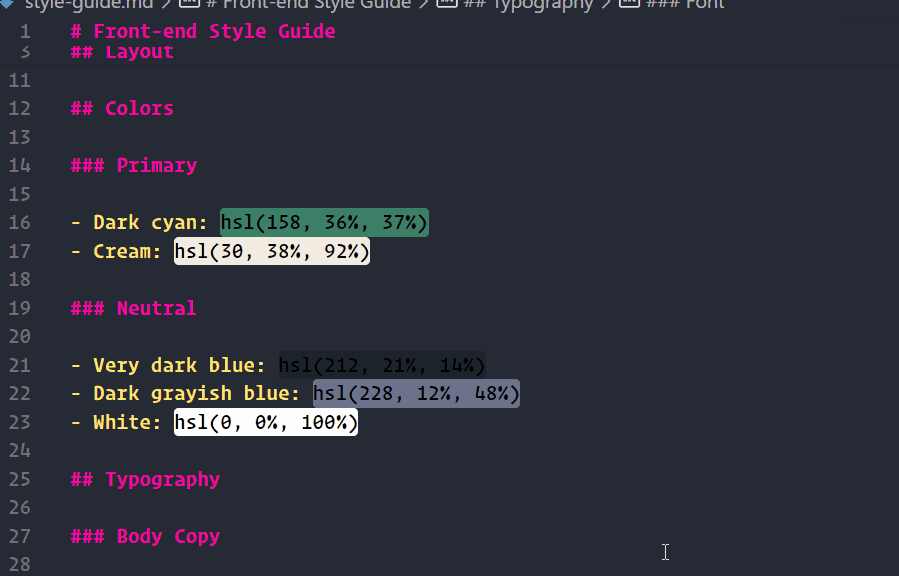

# variables-generator 

Generate CSS Variables from Frontend Mentor 

## Features

Convert Frontend Mentor style guide's instructions to CSS Variables

## Release Notes

### 1.0.0

Initial release of Variables Generator

## Author

David Ruiz - Frontend Developer
- [Github](https://github.com/Davichobits)
- [Frontend Mentor](https://www.frontendmentor.io/profile/Davichobits) 
- [Linkedin](https://www.linkedin.com/in/davidirc/)
- [YouTube](https://www.youtube.com/CodingTube)
- [codingtube.dev](https://codingtube.dev/)

**Enjoy!**
